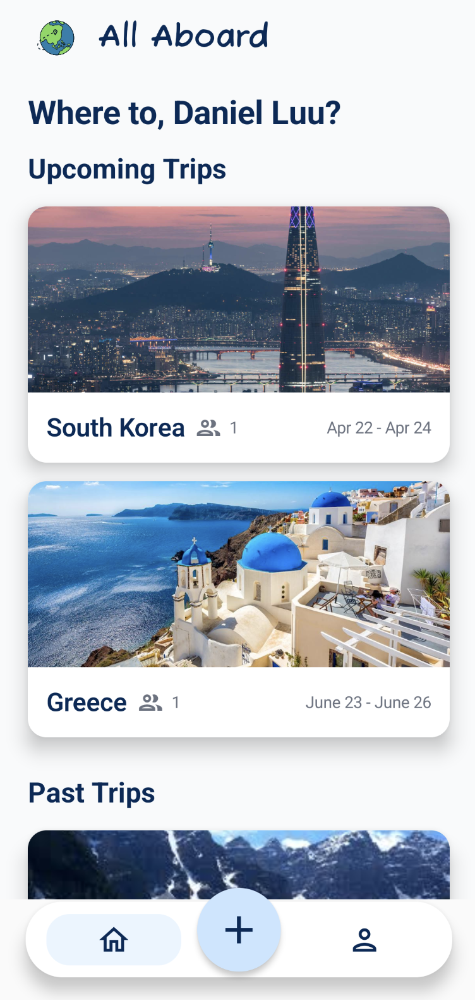

# Team-102-8
## AllAboard
The Tinder for travel planning!

{width=50%}

[Video Walkthrough](https://youtube.com/shorts/FXj01XOmQRE?feature=share)

[Acknowledgements](https://git.uwaterloo.ca/b57liu/team-102-8/-/wikis/home/acknowledgements)

[Release] (https://git.uwaterloo.ca/b57liu/team-102-8/-/wikis/home/Version-1.0.0-Release)

### Team Details
Daniel Luu; Tech Lead; d2luu@uwaterloo.ca

Rachael Sun; Team Lead; r227sun@uwaterloo.ca

Bethany Liu; Backend Designer; b57liu@uwaterloo.ca

Sarah Kwak; Frontend Designer; s3kwak@uwaterloo.ca

### Project Information

- [Team contract](https://git.uwaterloo.ca/b57liu/team-102-8/-/wikis/home/Team-Contract)
- [Project Proposal](https://git.uwaterloo.ca/b57liu/team-102-8/-/wikis/home/Project-Proposal)
- [Meeting Minutes](https://git.uwaterloo.ca/b57liu/team-102-8/-/wikis/home/Meeting-Minutes)
- [Team Reflections](https://git.uwaterloo.ca/b57liu/team-102-8/-/wikis/home/team-reflections)

### User Guide
- [Getting Started](https://git.uwaterloo.ca/b57liu/team-102-8/-/wikis/home/Getting-Started)
- [Usage Guide](https://git.uwaterloo.ca/b57liu/team-102-8/-/wikis/home/Usage-Guide)

### Design Documents
- [ERD Diagram](https://git.uwaterloo.ca/b57liu/team-102-8/-/wikis/home/ERD-Diagram)
- [UML Diagram](https://git.uwaterloo.ca/b57liu/team-102-8/-/wikis/home/UML-Diagram)

### Grading Instructions
- [Grading Instructions](https://git.uwaterloo.ca/b57liu/team-102-8/-/wikis/home/Grading-Instructions)