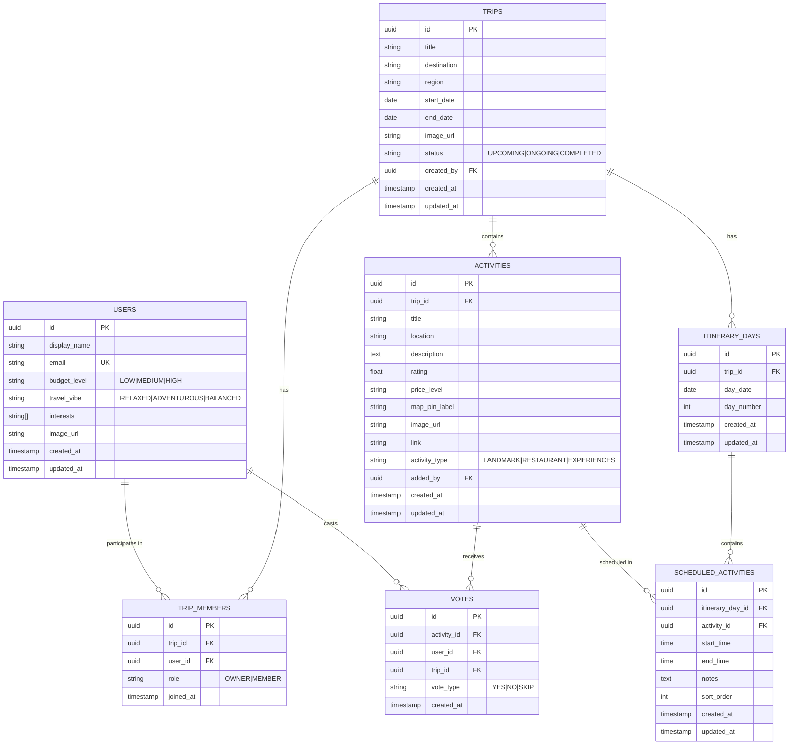

# Database Design - Sprint 3

## Overview

This document outlines the database schema design for the AllAboard trip planning application. The database will be implemented using **Supabase** (PostgreSQL backend with REST API).

## Entity-Relationship Diagram



## Table Descriptions

### 1. USERS
Stores user account information and preferences.
- **Primary Key**: `id` (UUID)
- **Unique Constraint**: `email`
- **Notes**: Supabase Auth can auto-populate user records

### 2. TRIPS
Stores trip information.
- **Primary Key**: `id` (UUID)
- **Foreign Key**: `created_by` → USERS(id)
- **Status Enum**: UPCOMING, ONGOING, COMPLETED

### 3. TRIP_MEMBERS (Junction Table)
Many-to-many relationship between users and trips.
- **Primary Key**: `id` (UUID)
- **Foreign Keys**: `trip_id` → TRIPS(id), `user_id` → USERS(id)
- **Unique Constraint**: (trip_id, user_id) - prevents duplicate membership

### 4. ACTIVITIES
Stores activities associated with trips.
- **Primary Key**: `id` (UUID)
- **Foreign Keys**: `trip_id` → TRIPS(id), `added_by` → USERS(id)
- **Activity Type Enum**: LANDMARK, RESTAURANT, EXPERIENCES

### 5. VOTES
Stores user votes on activities.
- **Primary Key**: `id` (UUID)
- **Foreign Keys**: `activity_id` → ACTIVITIES(id), `user_id` → USERS(id), `trip_id` → TRIPS(id)
- **Unique Constraint**: (activity_id, user_id) - one vote per user per activity
- **Vote Type Enum**: YES, NO, SKIP

### 6. ITINERARY_DAYS
Stores day-by-day breakdown of a trip itinerary.
- **Primary Key**: `id` (UUID)
- **Foreign Key**: `trip_id` → TRIPS(id)
- **Unique Constraint**: (trip_id, day_date)

### 7. SCHEDULED_ACTIVITIES
Stores scheduled activities within an itinerary day.
- **Primary Key**: `id` (UUID)
- **Foreign Keys**: `itinerary_day_id` → ITINERARY_DAYS(id), `activity_id` → ACTIVITIES(id)

## Relationships Summary

| Relationship | Type | Description |
|-------------|------|-------------|
| Users ↔ Trips | Many-to-Many | Through TRIP_MEMBERS junction table |
| Trips → Activities | One-to-Many | A trip contains many activities |
| Users → Votes | One-to-Many | A user casts many votes |
| Activities → Votes | One-to-Many | An activity receives many votes |
| Trips → Itinerary Days | One-to-Many | A trip has many itinerary days |
| Itinerary Days → Scheduled Activities | One-to-Many | A day contains many scheduled activities |

## Computed Views (Supabase)

### vote_results (View)
Aggregates vote data for activities:
```sql
CREATE VIEW vote_results AS
SELECT 
    a.id as activity_id,
    a.trip_id,
    COUNT(*) FILTER (WHERE v.vote_type = 'YES') as yes_votes,
    COUNT(*) FILTER (WHERE v.vote_type = 'NO') as no_votes,
    COUNT(*) as total_votes,
    COALESCE(
        COUNT(*) FILTER (WHERE v.vote_type = 'YES')::float / NULLIF(COUNT(*), 0), 
        0
    ) as yes_percentage
FROM activities a
LEFT JOIN votes v ON a.id = v.activity_id
GROUP BY a.id, a.trip_id;
```

## Row Level Security (RLS) Policies

Supabase uses RLS to secure data:

1. **Users**: Can read/update their own profile
2. **Trips**: Can read if member, can create, can update if owner
3. **Trip Members**: Can read if member of trip, owner can add/remove
4. **Activities**: Can read if member of trip, any member can add
5. **Votes**: Can read if member of trip, can only submit own votes
6. **Itinerary**: Can read/write if member of trip
