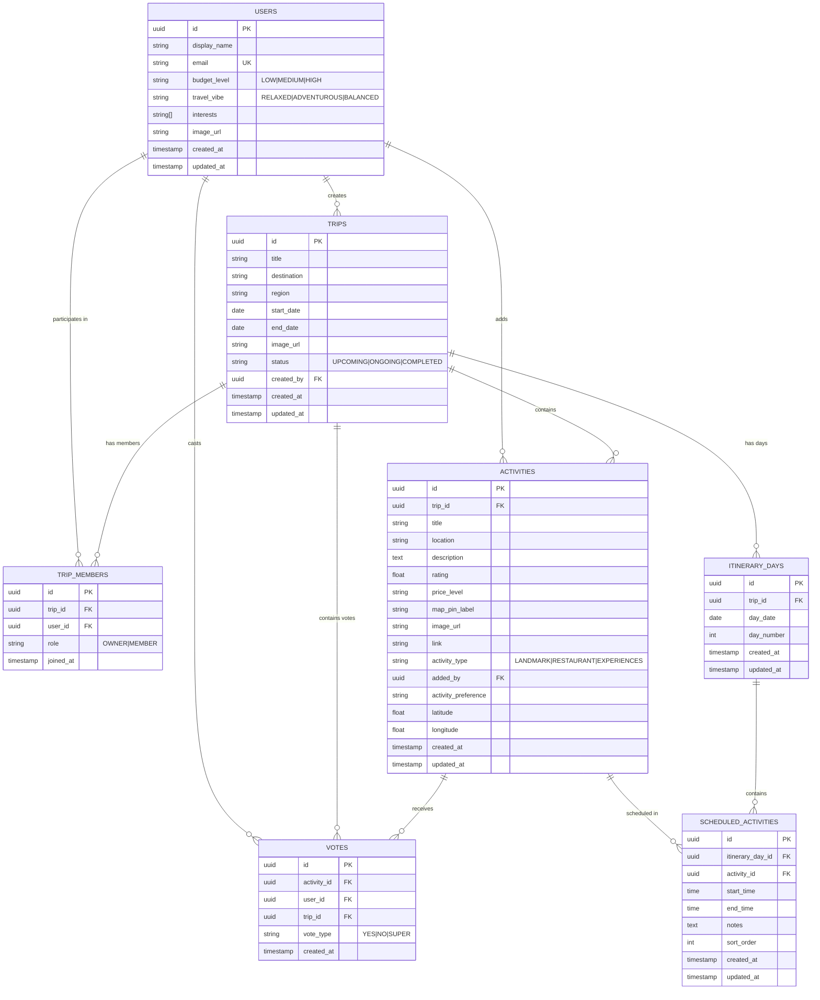

# Final Database Design

## Overview

This document captures the final database design for AllAboard.

## Entity-Relationship Diagram

## Enums

- `budget_level`: `LOW`, `MEDIUM`, `HIGH`
- `travel_vibe`: `RELAXED`, `ADVENTUROUS`, `BALANCED`
- `trip_status`: `UPCOMING`, `ONGOING`, `COMPLETED`
- `activity_type`: `LANDMARK`, `RESTAURANT`, `EXPERIENCES`
- `vote_type`: `YES`, `NO`, `SUPER`
- `member_role`: `OWNER`, `MEMBER`

## Table Descriptions

### 1. USERS
Stores user account information and preferences.
- **Primary Key**: `id` (UUID)
- **Unique Constraint**: `email`
- **Notes**: Supabase Auth can auto-populate user records

### 2. TRIPS
Stores trip information.
- **Primary Key**: `id` (UUID)
- **Foreign Key**: `created_by` -> USERS(id)
- **Status Enum**: UPCOMING, ONGOING, COMPLETED

### 3. TRIP_MEMBERS (Junction Table)
Many-to-many relationship between users and trips.
- **Primary Key**: `id` (UUID)
- **Foreign Keys**: `trip_id` -> TRIPS(id), `user_id` -> USERS(id)
- **Unique Constraint**: `(trip_id, user_id)` - prevents duplicate membership
- **Role Enum**: OWNER, MEMBER

### 4. ACTIVITIES
Stores activities associated with trips.
- **Primary Key**: `id` (UUID)
- **Foreign Keys**: `trip_id` -> TRIPS(id), `added_by` -> USERS(id)
- **Activity Type Enum**: LANDMARK, RESTAURANT, EXPERIENCES
- **Additional Fields**: `activity_preference`, `latitude`, `longitude`

### 5. VOTES
Votes from trip members on activities.
- **Primary Key**: `id` (UUID)
- **Foreign Keys**: `activity_id` -> ACTIVITIES(id), `user_id` -> USERS(id), `trip_id` -> TRIPS(id)
- **Unique Constraint**: `(activity_id, user_id)` - one vote per user per activity
- **Vote Type Enum**: YES, NO, SUPER

### 6. ITINERARY_DAYS
Stores day-by-day breakdown of a trip itinerary.
- **Primary Key**: `id` (UUID)
- **Foreign Key**: `trip_id` -> TRIPS(id)
- **Unique Constraint**: `(trip_id, day_date)`

### 7. SCHEDULED_ACTIVITIES
Specific timed itinerary items for each trip day.
- **Primary Key**: `id` (UUID)
- **Foreign Keys**: `itinerary_day_id` -> ITINERARY_DAYS(id), `activity_id` -> ACTIVITIES(id)

## Relationships Summary

| Relationship | Type | Description |
|---|---|---|
| Users -> Trips | One-to-Many | A user can create many trips (`created_by`) |
| Users <-> Trips | Many-to-Many | Through `trip_members` |
| Trips -> Activities | One-to-Many | A trip contains many activities |
| Users -> Activities | One-to-Many | A user can add many activities (`added_by`) |
| Trips -> Votes | One-to-Many | Votes are scoped to a trip |
| Activities -> Votes | One-to-Many | An activity receives many votes |
| Users -> Votes | One-to-Many | A user can cast many votes |
| Trips -> Itinerary Days | One-to-Many | A trip has many itinerary days |
| Itinerary Days -> Scheduled Activities | One-to-Many | A day contains many scheduled activities |
| Activities -> Scheduled Activities | One-to-Many | An activity can be scheduled multiple times |

