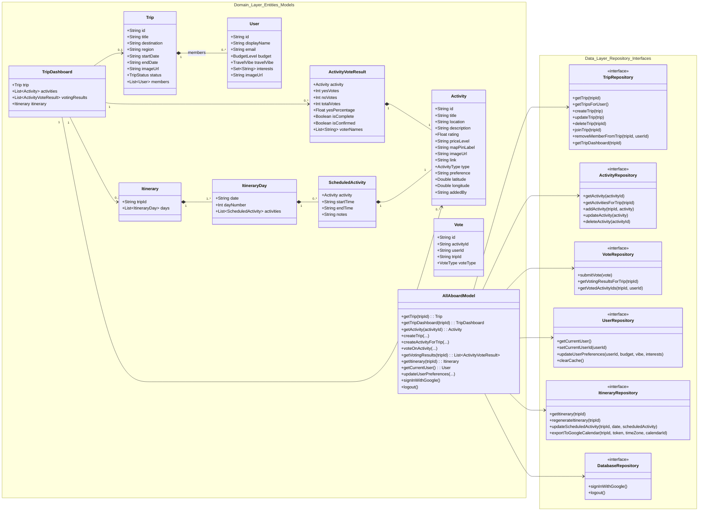
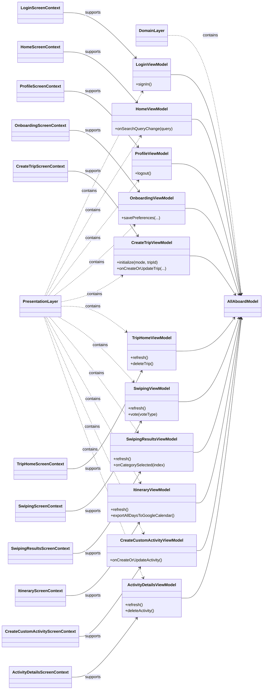

# UML Class Diagrams (Main Classes)

These diagrams focus on the most important classes in the layered architecture:

- **Entities/Models** (Domain + Data layer interfaces)
- **ViewModels** (Presentation layer, with supported screens)
- **Relationships between classes**

## 1) Domain + Data Layer

## 2) Presentation Layer (ViewModels by Screen)

Note: `*ScreenContext` nodes indicate mapping context only (not UI compose implementation classes).

## Screen-to-ViewModel Map

- `LoginScreen` -> `LoginViewModel`
- `HomeScreen` -> `HomeViewModel`
- `ProfileScreen` -> `ProfileViewModel`
- `OnboardingScreen` -> `OnboardingViewModel`
- `CreateTripScreen` -> `CreateTripViewModel`
- `TripHomeScreen` -> `TripHomeViewModel`
- `SwipingScreen` -> `SwipingViewModel`
- `SwipingResultsScreen` -> `SwipingResultsViewModel`
- `ItineraryScreen` -> `ItineraryViewModel`
- `CreateCustomActivityScreen` -> `CreateCustomActivityViewModel`
- `ActivityDetailsScreen` -> `ActivityDetailsViewModel`
